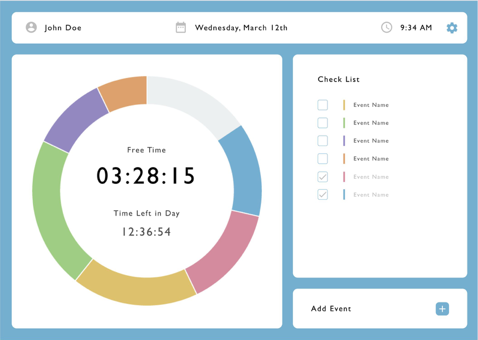
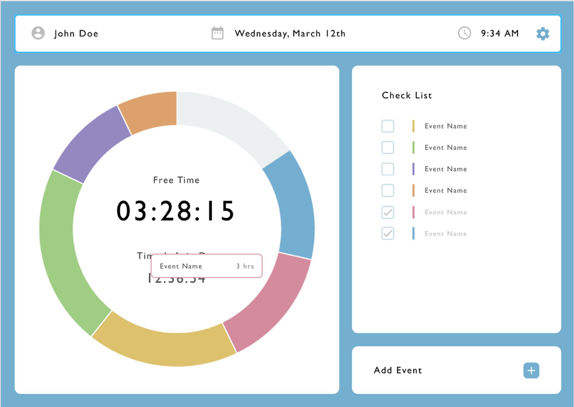
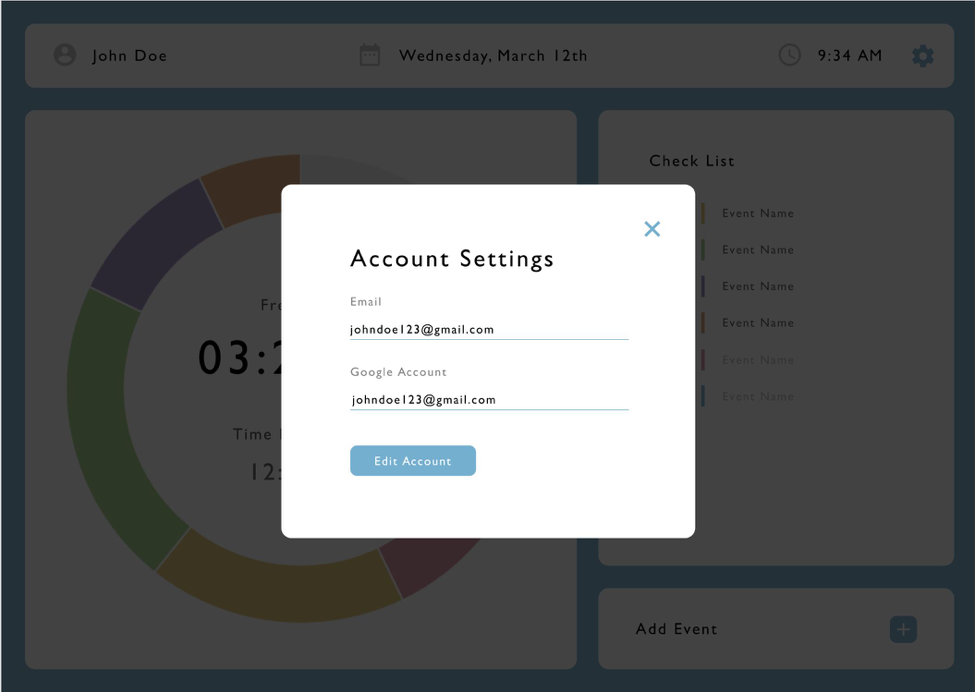

## **Break Breakdown**
##### Version: 1.0
##### Team: Andrew Tran, Benjamin Nogawa, Constance La, Juan Alvarez, Phillip Park

---
## **Table of Content**
### 1 Problem
### 2 Solution: Application Screens
### 3 References
---
## **1 Problem**
#### It is often easy to lose track of time and as a result we often find ourselves at the end of the day feeling like we wasted more time than we should have. Many college students can attest to this as they are often losing track of time resulting in them not being as productive as they can or should be. 
#### College is incredibly expensive and falling behind can be costly, not only in time, but in money. In order to test student’s experiences with falling behind, we developed a survey (n=40) which showed that many students find themselves feeling like they are falling behind on work due to the lack of productivity throughout the day.  
#### A little more than half of the participants stated that they plan their classes and other work related activities on calendar platforms such as Google Calendar or iCal however these platforms have limitations as they often do not provide useful feedback to users. This limitation is supported by our survey which found that 52% of those that plan out their day using organizing software find themselves falling behind and not having as much free time as they would if they used their time efficiently. These findings show that even though planning one’s day on a calendar can be a useful organizational strategy, it does not necessarily correlate with efficient time use or an increase in free time. 
#### Most students have 15 hours of classes per week, which is typical since the average full time credit load is 15, but the amount of free time per week varies greatly. Free time is defined as any time spent on activities not doing homework, working out, club activities, and socializing. It’s important for students to have time to work out, socialize, and attend club activities as they tend to lower anxiety. About 92% of participants stated that they would be more productive in the day if they knew how much time they were wasting and that having an application that displayed a visual representation of their schedule during the day would help them be more productive.
#### Planning and organization is a crucial component to effective time management. There are many widely used software tools on the market which help with planning and organization, however few provide the useful feedback necessary to motivate individuals to use their time more efficiently. Many individuals are in fact open to the concept of utilizing additional tools which would provide real time feedback and visual representations of the time they are wasting to help them be more productive during their day.  

---
## **2 Solution: Application Screens**
### **2.1 Sign-In and Sign-Up**
 

#### We are adding account functionality to our website. This will allow users to keep track of their tasks and history. All data such as what they have to do on their current day, how well they did on their previous days, their future day plans will be stored on Firebase using their account. 

#### We are using email rather than username because our application doesn’t necessarily require interaction so the users will not need their own username. They just need to signup and login so data can be connected to them.

### **2.2 Sign-Up**

#### First name and last name user inputs to make the website feel more personal. Also to include in email if we need to notify our users about anything. Password and confirm password to ensure our users input the correct password and don’t get locked out of their account. 

#### Sign in button at the bottom of the form as is a common affordance in sign up pages. Option to go to the sign in page if the user already has an account on the bottom which is another common affordance.

### **2.3 Sign-In**

#### Basic sign in page. Title of website on the top to indicate that users are logging into Break Breakdown. Uses email and password for sign in because that’s what they sign up with.. Sign in button on the bottom of the form to comply with affordances. Option to switch back to sign up page on the bottom of the screen in case they don’t have an account yet when reaching this page.

### **2.4 Home Page**

#### The information section on the top left of the screen indicates that the user is logged into the correct account and reminds them what the current day and time is. This is relevant information that ensures the user will be able to plan out their day accordingly and stay on track. The settings button is blue to unify the different aspects of the website. The button will lead to a profile screen where they can edit some of their settings of their profile.
#### The checklist section contains all the events that the user has inputted into their BreakBreakdown. It is a list form of all the tasks they have to finish that day. They will be able to check off each activity after they’ve finished performing it. After completing the activity, the amount of time that activity was supposed to take is added to the user’s free time section. This shows visual incentives to our users that when they accomplish something fast they get more free time. The colors next to the events will correspond to the colors on the chart so users can connect the charts visuals to the checklist text quickly and easily. When an event is clicked on in the checklist it will send users to the event details screen.
#### The add event section is where users can add individual events that they have to do that day. The title section is where users will label what that activity is. Start time is the time when they think they will begin performing that event. End time is when they think they will finish it. Start and end time is important in our application to keep track of how much time each event will take. This way, we can add that portion of time to their free time after they complete it. The plus button is the action users will take to add the event to their checklist and graph. We made it the same blue as our theme to incorporate unity throughout our website.

### **2.5 Home Page: Hover**

#### When a user hovers over a section in the circle chart, information will pop up about it the event that section represents. The information is the event name to remind the user which events are left as well as how long it is expected to take to finish that task. This is so they can prioritize certain events by what they are and how much time it takes. The border around this information is the same color as the sections they represent so the user can be reassured they’re hovering over the correct section. 

### **2.6 Setting**

#### This is the screen shown after users click the settings button on the home page. They will be able to change their email and password. This is in case they create a new email for other purposes or if they feel their information has been compromised. They also have the option to import their google calendars account to automatically have events in their checklist. This makes it easier for users to use our website if they already utilize an app like google calendars. This speeds up the user efficiency and makes our application even easier and more time saving.

#### This is the screen shown after a user clicks on the event in the checklist. It contains relevant information such as start and end time, location, and any notes they want to put in for the event. The start and end time is important to keep track of so they know when they planned to do a certain event. The location is important so they can remember where they have to go to do the event. Notes may or may not be important depending on the type of event the user inputs. It will likely be important in more cases than not. However, even if it’s not useful for a certain event, it won’t impede on the usability if a user doesn’t input anything in that section. 
#### The accent colors of the popup will be the same as the color representing it in the checklist and in the graph. This is to keep a connection between different screens of our application. Keeping connections between screens make it easier for a user to follow the information being shown to them.
#### The edit and exit button are on the top right because that’s where these types of buttons usually are in interfaces. The edit button will take them to the event edit screen. The exit button returns them to the home page.

#### Much of the event edit screen is the same as the event details screen. The differences are that each piece of information will be editable. There is also the addition of the save, cancel, and trash buttons. Having an edit option is important in case our users make a mistake when first entering their event. This also allows our users to add notes if anything important comes up regarding this event.
#### The save button will save all changes a user has changed in the input boxes. The cancel button will discard all changes and revert the event back to before the edit. The trash button will remove the event completely. These options are important in case a user changes their mind about their edits or doesn’t need to do the event anymore.

---
## **3 References**
#### Link to the survey responses: [Google Survery](https://docs.google.com/spreadsheets/d/1bP7yiP73uqqgH2g6nE2kK508kycIfuRe8nQ8ab1X7uY/edit?usp=sharing)
---
