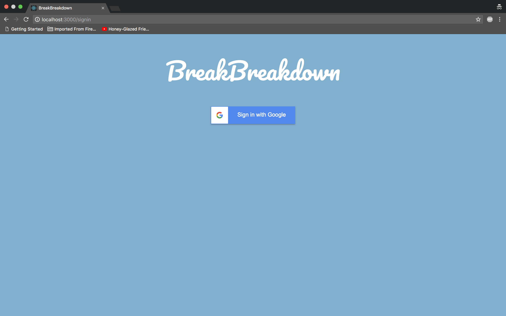
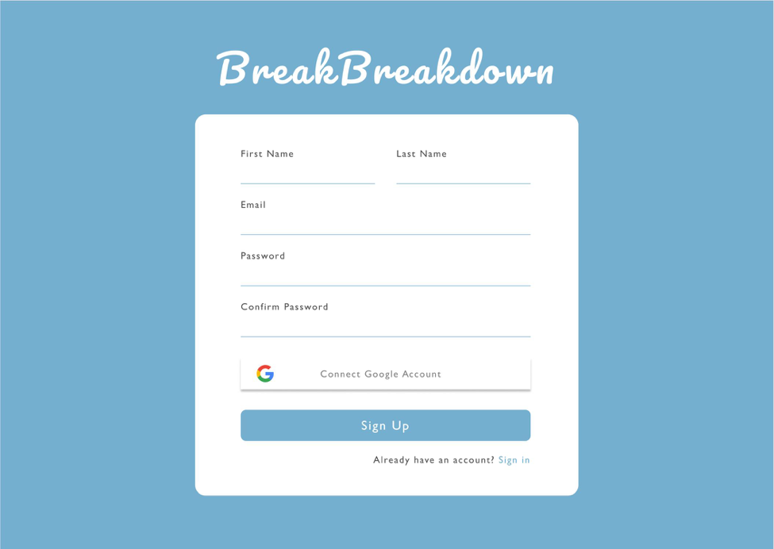

## **Break Breakdown**
##### Version: 1.0
##### Team: Andrew Tran, Benjamin Nogawa, Constance La, Juan Alvarez, Phillip Park

---
## **Table of Content**
### 1 Problem
### 2 Solution
### 3 Application Screens
### 4 References
---
## **1 Problem**
#### It is often easy to lose track of time and as a result we often find ourselves at the end of the day feeling like we wasted more time than we should have. Many college students can attest to this as they are often losing track of time resulting in them not being as productive as they can or should be. 
#### College is incredibly expensive and falling behind can be costly, not only in time, but in money. In order to test student’s experiences with falling behind, we developed a survey (n=40) which showed that many students find themselves feeling like they are falling behind on work due to the lack of productivity throughout the day.  
#### A little more than half of the participants stated that they plan their classes and other work related activities on calendar platforms such as Google Calendar or iCal however these platforms have limitations as they often do not provide useful feedback to users. This limitation is supported by our survey which found that 52% of those that plan out their day using organizing software find themselves falling behind and not having as much free time as they would if they used their time efficiently. These findings show that even though planning one’s day on a calendar can be a useful organizational strategy, it does not necessarily correlate with efficient time use or an increase in free time. 
#### Most students have 15 hours of classes per week, which is typical since the average full time credit load is 15, but the amount of free time per week varies greatly. Free time is defined as any time spent on activities not doing homework, working out, club activities, and socializing. It’s important for students to have time to work out, socialize, and attend club activities as they tend to lower anxiety. About 92% of participants stated that they would be more productive in the day if they knew how much time they were wasting and that having an application that displayed a visual representation of their schedule during the day would help them be more productive.
#### Planning and organization is a crucial component to effective time management. There are many widely used software tools on the market which help with planning and organization, however few provide the useful feedback necessary to motivate individuals to use their time more efficiently. Many individuals are in fact open to the concept of utilizing additional tools which would provide real time feedback and visual representations of the time they are wasting to help them be more productive during their day.  

---
## **2 Solution** 
---
## **3 Application Screens**
### **3.1 Sign-In and Sign-Up**
 

#### We are adding account functionality to our website. This will allow users to keep track of their tasks and history. All data such as what they have to do on their current day, how well they did on their previous days, their future day plans will be stored on Firebase using their account. 

#### We are using email rather than username because our application doesn’t necessarily require interaction so the users will not need their own username. They just need to signup and login so data can be connected to them.

### **3.2 Sign-Up**

#### First name and last name user inputs to make the website feel more personal. Also to include in email if we need to notify our users about anything. Password and confirm password to ensure our users input the correct password and don’t get locked out of their account. 

#### Sign in button at the bottom of the form as is a common affordance in sign up pages. Option to go to the sign in page if the user already has an account on the bottom which is another common affordance.

### **3.3 Sign-In**

#### Basic sign in page. Title of website on the top to indicate that users are logging into Break Breakdown. Uses email and password for sign in because that’s what they sign up with.. Sign in button on the bottom of the form to comply with affordances. Option to switch back to sign up page on the bottom of the screen in case they don’t have an account yet when reaching this page.

### **4.4 Home Page**

---
## **4 References**
---
